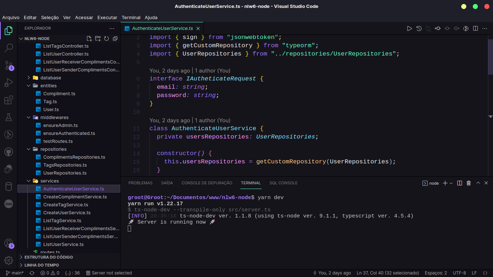

<h1 align="center">
    NLW 6 - Valoriza
</h1>


<p align="center">
  
</p>


## 🚀 Tecnologias

Node.js

Typescript

Express

Typeorm

PostgreSQL

JWT -> Autenticação com json web token

## 💻 Projeto

Valoriza é uma plataforma para promover o reconhecimento entre companheiros de equipe.


## 📜 Como executar

Clone o pojeto

```
    git clone 
```

Acesse a pasta do projeto e instale as dependências

```
    cd path-projeto

    yarn install
```

Configure as variaveis de ambiente com as crendências necessárias. Obs: O projeto conta com um arquivo de exemplo

Execute as migrations para a criação das tabelas do banco de dados

```
    yarn typeorm migration:run
```

Execute o servidor com:

```
    yarn dev
```

## 💻 Regras da aplicação

- Cadastro de usuário
  - [x] Não é permitido cadastrar mais de um usuário com o mesmo e-mail
  
  - [x] Não é permitido cadastrar usuário sem email usuário

- Cadastro da TAG
   - [x] Não é permitido cadastrar tag sem nome 
   
   - [x] Não é permitido cadastrar mais de uma tag com o mesmo nome

   - [x] Não é permitido cadastro por usuário que não sejam administradores

-  Cadastro de elogios
  
   - [x] Não é permitido um usuário cadastrar um elogio para si
   
   - [x] Não é permitido cadastrar elogios para usuários inválidos
   
   - [x] o usuário precisa está autenticado na aplicação 


## ✍️ Outras referências

Documentação de pacotes usados durante o projeto no notion:

### 🌍 [NLW 6 - Valoriza](https://indigo-hisser-408.notion.site/Documenta-o-NLW-6-valoriza-71db286579814f2f8f89ff1aecadd9a7)

### 🌍 [Modelo do banco de dados](https://whimsical.com/tables-app-SsjM5PUH216cXrgi8NDwhb)

## License

[MIT](https://choosealicense.com/licenses/mit/)
